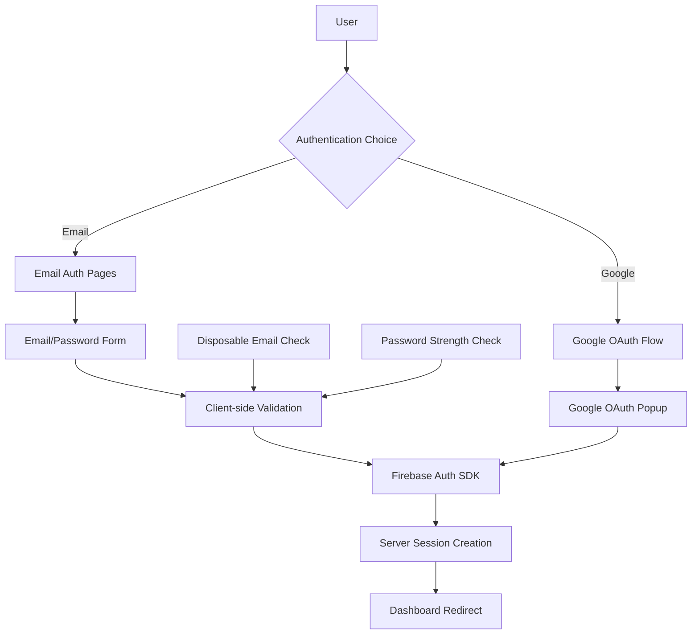

# Design Document

## Overview

This design extends the existing Firebase Authentication system to support email/password authentication alongside the current Google OAuth implementation. The solution will create dedicated signup and login pages with clean, MUI-themed interfaces that integrate seamlessly with the existing authentication flow and user management system.

## Architecture

### Authentication Flow Architecture



### Page Structure

```
/signup
├── Email/Password Form
├── Google OAuth Button
├── Link to Login
└── Terms/Privacy Links

/login  
├── Email/Password Form
├── Google OAuth Button
├── Link to Signup
└── Forgot Password Link
```

## Components and Interfaces

### New Components

#### 1. EmailAuthForm Component
```typescript
interface EmailAuthFormProps {
  mode: 'signup' | 'login';
  onSubmit: (email: string, password: string) => Promise<void>;
  loading?: boolean;
  error?: string;
}
```

**Responsibilities:**
- Render email and password input fields with MUI styling
- Handle form validation and user input
- Display error messages and loading states
- Provide accessible form labels and ARIA attributes

#### 2. AuthPageLayout Component
```typescript
interface AuthPageLayoutProps {
  title: string;
  subtitle?: string;
  children: React.ReactNode;
  alternateAction: {
    text: string;
    linkText: string;
    href: string;
  };
}
```

**Responsibilities:**
- Provide consistent layout for auth pages
- Include Review Alert branding
- Handle responsive design
- Provide navigation between signup/login

#### 3. DisposableEmailValidator Utility
```typescript
interface EmailValidationResult {
  isValid: boolean;
  isDisposable: boolean;
  message?: string;
}

function validateEmail(email: string): EmailValidationResult;
```

**Responsibilities:**
- Validate email format using regex
- Check against disposable email domain list
- Return structured validation results

### Enhanced Existing Components

#### Updated Firebase Auth Service
```typescript
// New functions to add to src/lib/firebase/auth.ts
export async function signUpWithEmail(email: string, password: string): Promise<UserCredential>;
export async function signInWithEmail(email: string, password: string): Promise<UserCredential>;
export async function sendPasswordResetEmail(email: string): Promise<void>;
```

#### Updated Auth Button Component
- Rename to `GoogleAuthButton` for clarity
- Extract reusable authentication logic
- Maintain existing Google OAuth functionality

## Data Models

### User Model Extensions
The existing User model in MongoDB already supports email-based users through the Firebase UID system. No schema changes are required as Firebase handles the authentication method internally.

### Email Validation Data
```typescript
interface DisposableEmailDomain {
  domain: string;
  blocked: boolean;
  reason?: string;
}
```

**Storage:** Static list in constants file, expandable to external service

## Error Handling

### Client-Side Error Handling
```typescript
enum AuthErrorType {
  INVALID_EMAIL = 'invalid-email',
  WEAK_PASSWORD = 'weak-password',
  EMAIL_IN_USE = 'email-already-in-use',
  USER_NOT_FOUND = 'user-not-found',
  WRONG_PASSWORD = 'wrong-password',
  DISPOSABLE_EMAIL = 'disposable-email-blocked',
  NETWORK_ERROR = 'network-request-failed'
}

interface AuthError {
  type: AuthErrorType;
  message: string;
  field?: 'email' | 'password';
}
```

### Error Display Strategy
- Use existing React Toastify for system-level errors
- Inline field validation for form-specific errors
- Maintain consistent error messaging with existing patterns

### Server-Side Error Handling
- Leverage existing Firebase Admin SDK error handling
- Maintain current session cookie creation flow
- Log authentication attempts for security monitoring

## User Experience Flow

### Signup Flow
1. User navigates to `/signup`
2. Page displays email form and Google OAuth option
3. User enters email and password
4. Client validates email format and disposable domain check
5. Client validates password strength (minimum 8 characters)
6. Firebase creates user account
7. Server creates session cookie
8. User redirected to dashboard

### Login Flow
1. User navigates to `/login`
2. Page displays email form and Google OAuth option
3. User enters credentials
4. Firebase authenticates user
5. Server creates session cookie
6. User redirected to dashboard

### Error Recovery
- Invalid credentials: Clear form, show error message
- Network errors: Retry mechanism with exponential backoff
- Disposable email: Clear email field, show specific error message

## Security Considerations

### Password Requirements
- Minimum 8 characters (Firebase default)
- No maximum length restriction
- Client-side strength indicator
- Server-side validation through Firebase

### Email Validation
- RFC 5322 compliant email regex
- Disposable email domain blocking
- Case-insensitive email handling
- Trim whitespace from inputs

### Session Management
- Maintain existing session cookie approach
- 5-day session expiration
- Secure, HttpOnly cookies
- Automatic session refresh

## Testing Strategy

### Unit Tests
- Email validation utility functions
- Password strength validation
- Form submission handlers
- Error message display logic

### Integration Tests
- Complete signup flow with valid data
- Complete login flow with valid data
- Error handling for invalid inputs
- Google OAuth integration compatibility

### Accessibility Tests
- Screen reader compatibility
- Keyboard navigation
- Focus management
- ARIA label validation

### Security Tests
- Disposable email blocking
- Password strength enforcement
- Session cookie security
- CSRF protection validation

## Implementation Considerations

### Responsive Design
- Mobile-first approach using MUI breakpoints
- Touch-friendly form elements (44px minimum)
- Optimized keyboard layouts for mobile
- Consistent with existing theme system

### Performance
- Lazy load disposable email list
- Debounced email validation
- Optimized bundle size for auth pages
- Preload critical authentication resources

### SEO and Metadata
- Proper page titles and descriptions
- Canonical URLs for auth pages
- No-index for sensitive auth pages
- Structured data for authentication pages

### Internationalization Ready
- Extractable error messages
- RTL layout support through MUI
- Locale-aware email validation
- Accessible date/time formatting

## Migration Strategy

### Existing Users
- No migration required for Google OAuth users
- Existing session management remains unchanged
- Database schema compatible with both auth methods

### Deployment
- Feature flag for email authentication
- Gradual rollout capability
- Rollback plan for authentication issues
- Monitoring for authentication success rates