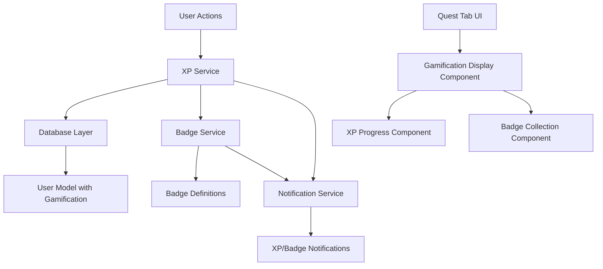

# Design Document

## Overview

The gamification system will enhance user engagement on ReviewQuest by implementing an XP (experience points) and badge system that rewards users for platform activities. The system will track user actions, award XP based on predefined rules, calculate badge achievements, and display progress information in the quest tab. This design integrates seamlessly with the existing Next.js/TypeScript/MongoDB architecture.

## Architecture

### High-Level Architecture



### Data Flow

1. **Action Tracking**: User performs platform actions (create quest, complete quest, add app, etc.)
2. **XP Calculation**: XP Service calculates points based on action type and user history
3. **Badge Evaluation**: Badge Service checks if new badges are earned based on XP and activity patterns
4. **Database Update**: User's gamification data is updated atomically
5. **UI Update**: Quest tab displays updated XP, level, and badges
6. **Notifications**: Toast notifications inform user of XP gains and badge achievements

## Components and Interfaces

### Database Schema Extensions

#### User Model Extension
```typescript
// Addition to existing User schema
export interface GamificationData {
  xp: number;
  level: number;
  badges: Badge[];
  streaks: {
    currentLoginStreak: number;
    longestLoginStreak: number;
    lastLoginDate?: Date;
  };
  activityCounts: {
    questsCreated: number;
    questsCompleted: number;
    questsInProgress: number;
    appsAdded: number;
    reviewInteractions: number;
  };
  xpHistory: XPTransaction[];
}

export interface Badge {
  id: string;
  name: string;
  description: string;
  iconUrl?: string;
  earnedAt: Date;
  category: BadgeCategory;
}

export interface XPTransaction {
  amount: number;
  action: XPAction;
  timestamp: Date;
  metadata?: Record<string, any>;
}

export enum BadgeCategory {
  MILESTONE = "MILESTONE",
  ACHIEVEMENT = "ACHIEVEMENT", 
  STREAK = "STREAK",
  COLLECTION = "COLLECTION"
}

export enum XPAction {
  QUEST_CREATED = "QUEST_CREATED",
  QUEST_IN_PROGRESS = "QUEST_IN_PROGRESS", 
  QUEST_COMPLETED = "QUEST_COMPLETED",
  APP_ADDED = "APP_ADDED",
  REVIEW_INTERACTION = "REVIEW_INTERACTION",
  LOGIN_STREAK_BONUS = "LOGIN_STREAK_BONUS"
}
```

### Service Layer

#### XP Service
```typescript
export class XPService {
  // XP award amounts
  private static readonly XP_VALUES = {
    [XPAction.QUEST_CREATED]: 10,
    [XPAction.QUEST_IN_PROGRESS]: 5,
    [XPAction.QUEST_COMPLETED]: 15,
    [XPAction.APP_ADDED]: 20,
    [XPAction.REVIEW_INTERACTION]: 8,
  };

  // Level thresholds
  private static readonly LEVEL_THRESHOLDS = [
    0, 100, 250, 500, 1000, 1750, 2750, 4000, 5500, 7500, 10000
  ];

  static async awardXP(userId: string, action: XPAction, metadata?: Record<string, any>): Promise<XPAwardResult>
  static async calculateLevel(xp: number): number
  static async getXPForNextLevel(currentXP: number): number
  static async calculateStreakBonus(streakDays: number): number
  static async getUserGamificationData(userId: string): Promise<GamificationData>
}

export interface XPAwardResult {
  xpAwarded: number;
  totalXP: number;
  levelUp: boolean;
  newLevel?: number;
  badgesEarned: Badge[];
}
```

#### Badge Service
```typescript
export class BadgeService {
  static async checkAndAwardBadges(userId: string, gamificationData: GamificationData): Promise<Badge[]>
  static async getBadgeDefinitions(): BadgeDefinition[]
  static async getUserBadges(userId: string): Promise<Badge[]>
  static async getBadgeProgress(userId: string): Promise<BadgeProgress[]>
}

export interface BadgeDefinition {
  id: string;
  name: string;
  description: string;
  iconUrl?: string;
  category: BadgeCategory;
  requirements: BadgeRequirement[];
}

export interface BadgeRequirement {
  type: 'xp' | 'activity_count' | 'streak' | 'combination';
  value: number;
  field?: string; // For activity_count type
}

export interface BadgeProgress {
  badge: BadgeDefinition;
  progress: number;
  target: number;
  earned: boolean;
}
```

### UI Components

#### Gamification Display Component
```typescript
export interface GamificationDisplayProps {
  user: User;
  gamificationData: GamificationData;
  onRefresh?: () => void;
}

export default function GamificationDisplay({ user, gamificationData, onRefresh }: GamificationDisplayProps)
```

#### XP Progress Component
```typescript
export interface XPProgressProps {
  currentXP: number;
  currentLevel: number;
  xpForNextLevel: number;
  recentTransactions: XPTransaction[];
}

export default function XPProgress({ currentXP, currentLevel, xpForNextLevel, recentTransactions }: XPProgressProps)
```

#### Badge Collection Component
```typescript
export interface BadgeCollectionProps {
  badges: Badge[];
  badgeProgress: BadgeProgress[];
  onBadgeClick?: (badge: Badge) => void;
}

export default function BadgeCollection({ badges, badgeProgress, onBadgeClick }: BadgeCollectionProps)
```

## Data Models

### Badge Definitions
```typescript
export const BADGE_DEFINITIONS: BadgeDefinition[] = [
  {
    id: 'getting-started',
    name: 'Getting Started',
    description: 'Earned your first 100 XP',
    category: BadgeCategory.MILESTONE,
    requirements: [{ type: 'xp', value: 100 }]
  },
  {
    id: 'quest-explorer', 
    name: 'Quest Explorer',
    description: 'Reached 500 XP',
    category: BadgeCategory.MILESTONE,
    requirements: [{ type: 'xp', value: 500 }]
  },
  {
    id: 'review-master',
    name: 'Review Master', 
    description: 'Reached 1000 XP',
    category: BadgeCategory.MILESTONE,
    requirements: [{ type: 'xp', value: 1000 }]
  },
  {
    id: 'platform-expert',
    name: 'Platform Expert',
    description: 'Reached 2500 XP', 
    category: BadgeCategory.MILESTONE,
    requirements: [{ type: 'xp', value: 2500 }]
  },
  {
    id: 'quest-warrior',
    name: 'Quest Warrior',
    description: 'Completed 10 quests',
    category: BadgeCategory.ACHIEVEMENT,
    requirements: [{ type: 'activity_count', value: 10, field: 'questsCompleted' }]
  },
  {
    id: 'dedicated-user',
    name: 'Dedicated User', 
    description: 'Maintained a 7-day login streak',
    category: BadgeCategory.STREAK,
    requirements: [{ type: 'streak', value: 7 }]
  },
  {
    id: 'app-collector',
    name: 'App Collector',
    description: 'Added 5 or more apps to track',
    category: BadgeCategory.COLLECTION, 
    requirements: [{ type: 'activity_count', value: 5, field: 'appsAdded' }]
  },
  {
    id: 'quest-legend',
    name: 'Quest Legend',
    description: 'Completed 50 quests',
    category: BadgeCategory.ACHIEVEMENT,
    requirements: [{ type: 'activity_count', value: 50, field: 'questsCompleted' }]
  }
];
```

### XP Calculation Rules
```typescript
export const XP_RULES = {
  // Base XP values
  BASE_XP: {
    [XPAction.QUEST_CREATED]: 10,
    [XPAction.QUEST_IN_PROGRESS]: 5, 
    [XPAction.QUEST_COMPLETED]: 15,
    [XPAction.APP_ADDED]: 20,
    [XPAction.REVIEW_INTERACTION]: 8,
  },
  
  // Streak bonuses
  STREAK_BONUSES: {
    3: 5,   // 3+ day streak: +5 XP
    7: 10,  // 7+ day streak: +10 XP  
    14: 15, // 14+ day streak: +15 XP
  },
  
  // Level thresholds
  LEVEL_THRESHOLDS: [0, 100, 250, 500, 1000, 1750, 2750, 4000, 5500, 7500, 10000],
};
```

## Error Handling

### XP Service Error Handling
- **Database Connection Errors**: Retry mechanism with exponential backoff
- **Concurrent Updates**: Use atomic operations and optimistic locking
- **Invalid Actions**: Validate action types and user permissions
- **Data Integrity**: Ensure XP values are never negative, validate badge requirements

### Badge Service Error Handling  
- **Badge Definition Errors**: Fallback to default badge configurations
- **Requirement Validation**: Validate badge requirements before awarding
- **Duplicate Awards**: Prevent duplicate badge awards with unique constraints

### UI Error Handling
- **Loading States**: Show skeleton loaders while fetching gamification data
- **Network Errors**: Display retry options and offline indicators
- **Data Sync Issues**: Show sync status and manual refresh options

## Testing Strategy

### Unit Tests
- **XP Service**: Test XP calculation, level progression, streak bonuses
- **Badge Service**: Test badge requirement evaluation, progress calculation
- **Database Operations**: Test atomic updates, data integrity constraints
- **UI Components**: Test rendering, user interactions, error states

### Integration Tests
- **End-to-End Flows**: Test complete user action → XP award → badge check → UI update flow
- **Database Integration**: Test gamification data persistence and retrieval
- **API Integration**: Test XP/badge API endpoints with various scenarios

### Performance Tests
- **XP Calculation Performance**: Test with large XP histories and multiple concurrent users
- **Badge Evaluation Performance**: Test badge checking with complex requirements
- **UI Rendering Performance**: Test gamification display with large badge collections

### Accessibility Tests
- **Screen Reader Compatibility**: Test XP progress and badge announcements
- **Keyboard Navigation**: Test badge collection and progress navigation
- **Color Contrast**: Ensure badge and XP displays meet accessibility standards

## Implementation Phases

### Phase 1: Core Infrastructure
- Extend User model with gamification data
- Implement XP Service with basic XP awarding
- Create database migration for existing users
- Add XP tracking to existing user actions

### Phase 2: Badge System
- Implement Badge Service and badge definitions
- Add badge evaluation logic
- Create badge progress tracking
- Integrate badge awards with XP system

### Phase 3: UI Integration
- Create gamification display components
- Integrate with Quest tab
- Add XP and badge notifications
- Implement progress indicators

### Phase 4: Advanced Features
- Add streak tracking and bonuses
- Implement advanced badge requirements
- Add gamification analytics
- Performance optimizations and caching